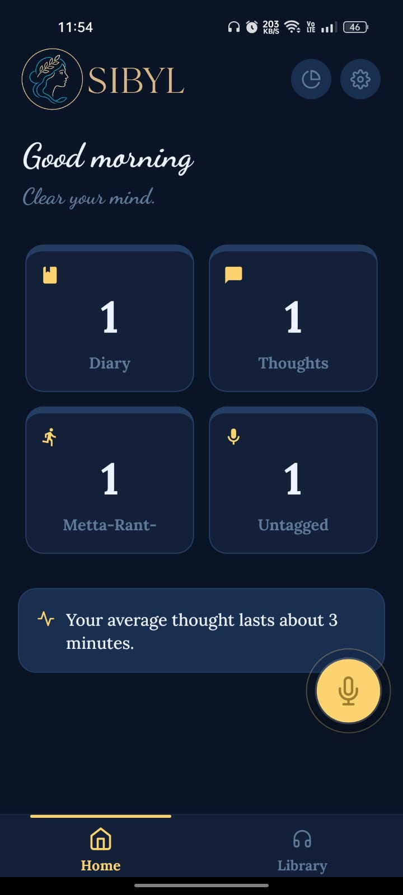
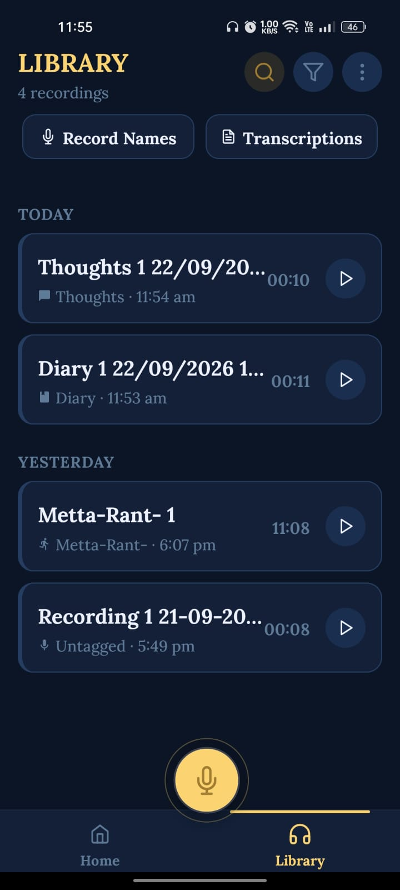
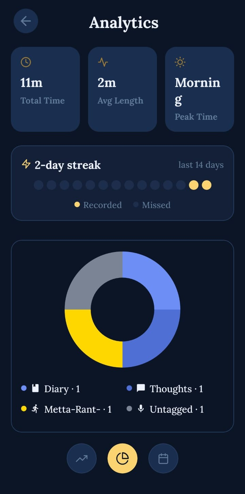
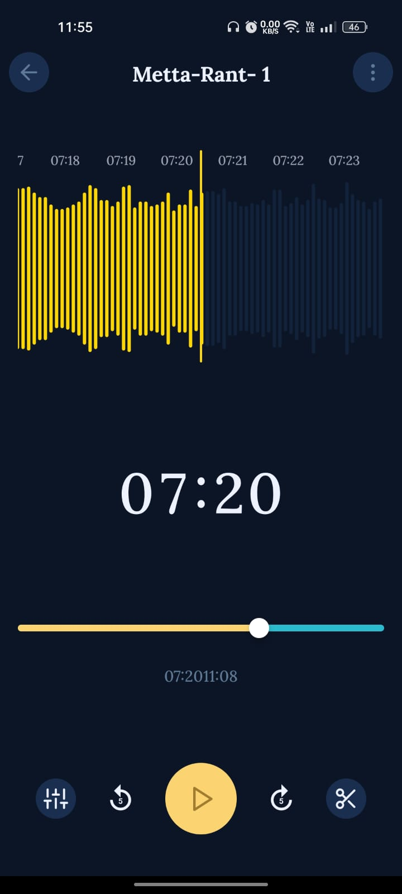
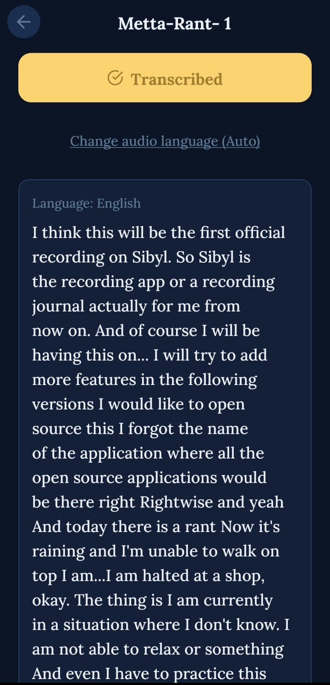

<div align="center">
  
  <h1>Sibyl: Speak, and be remembered</h1>
  <h3>A day, once spoken, is never fully lost.</h3>
  <p><em>A voice diary for the version of you who'll want this day back.</em></p>

[](https://opensource.org/licenses/MIT)
[](https://f-droid.org/)
[](#get-sibyl)

<strong><a href="#screenshots">Screenshots</a> · <a href="#features">Features</a> · <a href="#get-sibyl">Get Sibyl</a> · <a href="#building-from-source">Building from Source</a> · <a href="#groq-transcription-setup-optional">Groq Setup</a> · <a href="#contributing">Contributing</a> · <a href="#license">License</a></strong>
</div>

---

Keeping a diary is one of the best habits a person can build. Putting a day into words is the closest thing to living it twice and one of the few gifts you can give your future self, who will forget more than they'd like to admit. The only real problem with journaling is that most days end before anyone gets around to writing anything down.

Sibyl closes that gap. You just talk, for as long as the thought takes, and Sibyl handles the rest naming it, filing it, transcribing it, and keeping it safely on your own device, ready for whenever you, or future-you, want that day back.

Recording, playback, editing, tagging, and search all work **100% offline**. Your recordings never leave your device the one exception is transcription: if you add your own Groq API key, that specific audio is sent directly from your phone to Groq's API for that one request, and nowhere else. There's no Sibyl server, so there's nothing else to send it to. See [PRIVACY.md](PRIVACY.md) for the full picture.

## Screenshots

|                                Dashboard & Analytics                                |                                   Library & Organization                                    |
| :---------------------------------------------------------------------------------: | :-----------------------------------------------------------------------------------------: |
|        |              |
|  |  |

---

### On-demand or automatic transcription, powered by Groq's Whisper models:


  


## Features

- **Local-first architecture:** SQLite storage, no accounts, no analytics, no cloud lock-in. Your Groq key (if you add one) is kept in secure, encrypted device storage.
- **Non-destructive audio editing:** Trim, merge, and append recordings natively, powered by FFmpeg. Every edit produces a new file; your original recording is never overwritten.
- **Custom tags & naming templates:** Color- and icon-coded tags, each with its own token-based naming pattern (`{tag}`, `<count>`, `<date>`, `<time>`) or write a fully custom template by hand.
- **Smart organization:** Group by date, filter by tag and date range, and search either recording titles or full transcript text. Bulk share, rename, or delete.
- **On-demand or automatic AI transcription:** Convert speech to text with Groq's `whisper-large-v3-turbo`, with a Fast/Accurate model trade-off and a per-recording language override.
- **Optional two-way folder sync:** Back up recordings to a public device folder and import external audio files off by default, entirely your choice.
- **Playback controls:** Granular speed adjustment (0.5x–2x), skip-silence, and set any recording as your ringtone.
- **Dynamic theming:** 6 hand-crafted themes (3 dark, 3 light) and 6 typefaces, all previewed live as you choose them.
- **Detailed analytics:** Streak tracking, monthly activity, and per-tag trend/breakdown charts, so you can see your recording habit, not just your recordings.

## Get Sibyl

### Download the APK

Grab the latest lightweight APK directly from the [Releases](https://github.com/MettaSurendhar/sibyl/releases/tag/v1.0.0) page. It's compiled exclusively for `arm64-v8a` for a ~50% size reduction.

### F-Droid & IzzyOnDroid

Sibyl is fully open-source and built to satisfy F-Droid / IzzyOnDroid compliance all fonts, assets, and libraries are bundled internally rather than fetched at runtime.

---

## Building from Source

Built with React Native and Expo (Bare Workflow).

### Prerequisites

- Node.js (v18+)
- Android SDK & NDK

### Local Setup

```bash
# Clone the repository
git clone https://github.com/MettaSurendhar/sibyl.git
cd sibyl

# Install dependencies (also applies the native patches in patches/, automatically)
npm install

# Start the metro bundler
npx expo start --dev-client
```

Running the test suite, linting, project layout, and how to submit a change are covered in [CONTRIBUTING.md](CONTRIBUTING.md).

## Groq Transcription Setup (Optional)

Transcription is entirely opt-in and requires your own key:

1. Generate a free API key at [console.groq.com/keys](https://console.groq.com/keys).
2. Open the app → Settings ⚙️ → Transcription, and paste the key.
3. Sibyl compresses and chunks your audio before sending it, keeping requests small and fast.
4. Only the recording you transcribe is sent, only to Groq, only for that one request nothing is stored or logged by Sibyl itself.

## Contributing

Bug reports, feature ideas, and pull requests are all welcome — see [CONTRIBUTING.md](CONTRIBUTING.md) for project layout, setup, and how to submit a change, or just open an [issue](https://github.com/MettaSurendhar/sibyl/issues).

## License

Sibyl is released under the **MIT License**. See the `LICENSE` file for more details.
